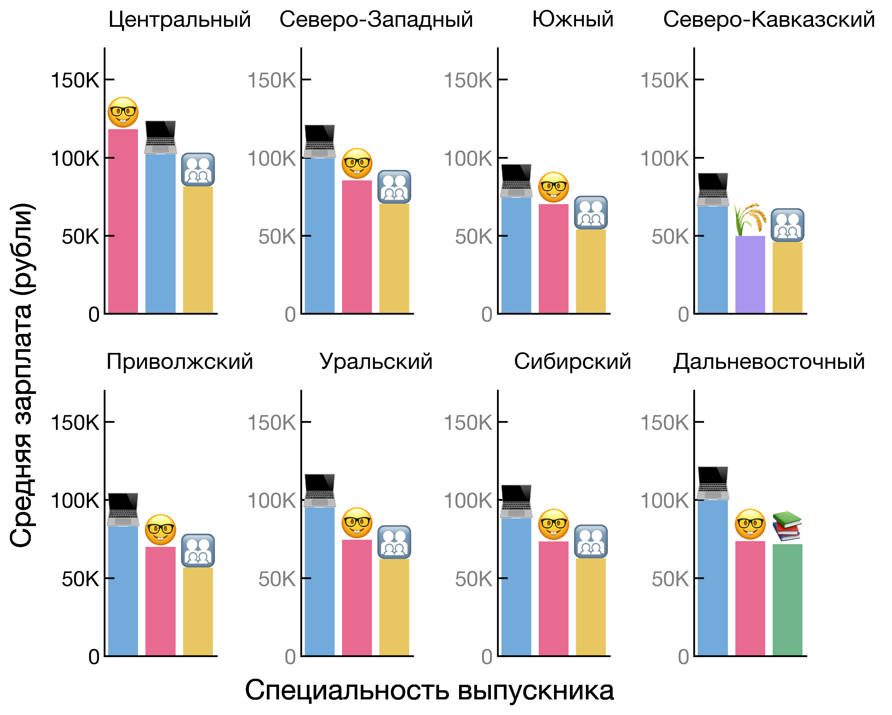

## [Посмотреть результаты анализа](https://mbelveder.github.io/ru_graduates/) (оптимально с ПК)

Анализ произведен при помощи Python специально для курса «Python для анализа данных (ФГГТ ВШЭ).

Python для анализа данных — это как Excell на стероидах. Порог вхождения выше, поскольку приходится писать код вместо взаимодействия с графическим интерфейсом. Однако Python — гораздо более гибкий инструмент, позволяющий более полно реализовать ваши задумки. Приведу пример (подробнее смотрите по ссылке выше):

### Топ-3 специальностей по среднему размеру зарплат в разных федеральных округах РФ для выпускников бакалавриата

Почти во всех округах в топах представлены выпускники следующих спецальностей:

 инженерных и технических

 математических и естестеннонаучных

 общественно-научных

На графике специальность выпускника закодирована через цвет и эмодзи. Это позволяет не подписывать значения на горизонтальной оси. На графике находится много элементов, но восприятие от этого не страдает. Подписи по вертикальным осям преобразованы в понятный и лаконичный формат. Все это делается в автоматическом режиме — то есть график можно будет легко обновить при изменении датасета. Кроме того, код можно адаптировать для других данных.

Больше примеров и полное исследование по [ссылке](https://mbelveder.github.io/ru_graduates/) (оптимально с ПК).

__Если работа заинтересовала вас — поставьте ⭐︎ наверху этой страницы.__

Трудоустройство и зарплаты выпускников по направлениям подготовки//Роструд; обработка «Если быть точным», 2024. Условия использования: Creative Commons BY 4.0. URL: https://tochno.st/datasets/graduates_fields